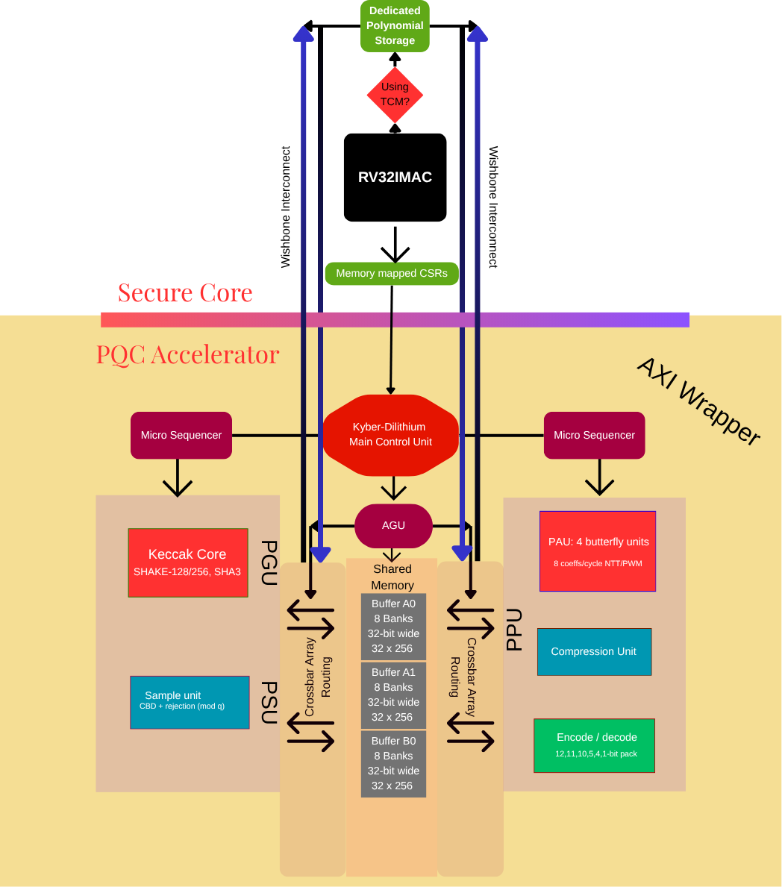

# High-Performance Post-Quantum Cryptography (PQC) Engine

Welcome to the **AXI PQC Wrapper & Engine** repository. This project is a production-ready, highly optimized SystemVerilog hardware accelerator designed to execute the heavy polynomial arithmetic required by NIST standard Post-Quantum Cryptography algorithms: **ML-KEM (Kyber)** and **ML-DSA (Dilithium)**.

Designed with enterprise-grade modularity and rigorous Python-driven verification, this accelerator demonstrates advanced hardware design paradigms including conflict-free memory routing, complex DSP pipelining, and scalable AXI4-Lite integration.

---

## 1. Capabilities & Core Features

*   **Dual-Algorithm Support**: Seamlessly executes multi-stage Decimation-in-Time (DIT) operations for both Kyber ($Q=3329$, 7 stages) and Dilithium ($Q=8380417$, 8 stages) using the same highly parallelized hardware pipeline.
*   **Massive Parallelism**: A 4-lane Polynomial Processing Unit (PPU) capable of executing 4 parallel butterfly operations, point-wise multiplications, or polynomial additions per clock cycle.
*   **Advanced Memory Architecture**: Abstracted Address Generation Unit (AGU) using XOR mangling to completely eliminate physical SRAM bank conflicts while enabling high-bandwidth in-place polynomial transformations.
*   **Plug-and-Play SoC Integration**: Fully encapsulated within an AXI4-Lite slave wrapper, allowing embedded processors (like ARM or RISC-V) to orchestrate complex cryptographic workflows with single-word configuration writes.

---

## 2. PQC Design & Architecture Document

### High-Level Block Diagram

### Pipeline Architecture
The mathematical core revolves around a synchronized, high-throughput pipeline:
- **4-Cycle Fixed Latency**: Core operations (like the $B \cdot \zeta$ modular multiplication paths) are rigidly bound to a 4-cycle pipeline latency. 
- **Phase-Aligned Execution**: Delay shift-registers internally realign the $A$ and $B$ coefficients, ensuring they hit the final modular adder/subtractor at the exact same clock tick.
- **Dynamic Pipelined Routing**: The pipeline depth dynamically multiplexes itself based on the algorithmic phase (e.g. INTT taps earlier in the pipeline than FWD NTT). To prevent structural hazards, pipeline control signals propagate alongside the data, self-validating their operating mode before writing back to memory.

### Modular Reduction Strategy: Why Barrett over Montgomery?
In PQC accelerator design, modular reduction is the most critical bottleneck. This engine utilizes **Barrett Reduction** rather than Montgomery Reduction for several targeted reasons:
1. **Domain Isolation Overhead**: Montgomery reduction requires transforming input operands into the Montgomery domain (multiplying by $R \pmod Q$) and transforming outputs back. While efficient for long chains of continuous multiplication, PQC NTT butterflies interleave multiplications immediately with additions and subtractions. Barrett directly computes $X \pmod Q$ without requiring domain shifts.
2. **Compile-Time Constant Moduli**: Both Kyber and Dilithium utilize small, fixed prime moduli. Barrett reduction relies on a precomputed quotient estimation ($\mu = \lfloor 4^k / Q \rfloor$). Because $Q$ never changes during execution, $\mu$ is synthesized as a highly optimized, hardcoded constant, drastically reducing DSP utilization.
3. **Hardware Reuse**: The Barrett multiplier logic can be natively reused across both compression/decompression phases and point-wise polynomial scaling with minimal routing overhead.

### Security: Constant-Time & Side-Channel Awareness
Cryptographic hardware must be resilient against timing-based side-channel attacks. 
- **Strict Determinism**: The PPU operates in strict constant-time. A 7-stage Kyber NTT will take the exact same number of clock cycles regardless of the polynomial's coefficient values. 
- **Data-Oblivious Addressing**: The AGU generates memory addresses and twiddle-factor ROM indices using loop iterators and stage trackers. Addressing logic has zero physical dependency on secret data.
- **Pipeline Flushing**: The FSM ensures strict batch tracking to flush pipeline residues between operations, preventing state-leakage between successive cryptographic contexts.

---

## 3. Verification Infrastructure

To guarantee mathematical perfection, the repository relies on a robust verification harness:
*   **Python Golden Model**: A bit-accurate software model that identically simulates the multi-stage Cooley-Tukey and Gentlemen-Sande FFT/NTT mathematics.
*   **Automated Hardware CI**: SystemVerilog testbenches dump real-time AGU fetch sequences and pipeline write-backs into `.hex` and `.log` formats.
*   **Demangling & Comparison**: A python parser demangles the physical XOR-addressed hardware logs, compares all thousands of arithmetic operations against the golden model, and generates a unified summary verifying flawless 100% mathematical parity.
